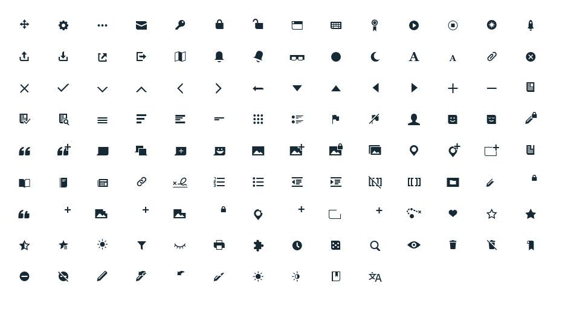

Current
----



WikiFont is a project by the Wikimedia Foundation.
 * [Phabricator](https://phabricator.wikimedia.org/tag/ui-standardization/) – icon requests
 * [Github page](https://github.com/wikimedia/WikiFont/) – developement base, last code & issues

Minimal HTML code
----
This minimal `demo.html` requires the font files and `wikiglyphs.css` of this repository.

````
<!DOCTYPE html>
<html lang="en">
  <head>
    <meta charset="utf-8">
    <title>WikiFont minimal code</title>
    <link rel="stylesheet" href="wikiglyphs.css">
    <style type="text/css">
    	i {
    		font-size: 24px;
    	}
    </style>
  </head>
	<body>
		<i class="wikiglyph wikiglyph-puzzle"></i>
		<i class="wikiglyph wikiglyph-bookmark"></i>
		<i class="wikiglyph wikiglyph-wikitrail"></i>
		<i class="wikiglyph wikiglyph-gear"></i>
		<i class="wikiglyph wikiglyph-user-face-smile"></i>
		<i class="wikiglyph wikiglyph-pencil"></i>
		<i class="wikiglyph wikiglyph-image-add"></i>
		<i class="wikiglyph wikiglyph-link"></i>
		<i class="wikiglyph wikiglyph-quotes-add"></i>
		<i class="wikiglyph wikiglyph-speech-bubbles"></i>
		and so on.
	</body>
</html>
````

Credit & License
----
MGalloway (WMF) / violetto released under the Modified BSD License. See LICENSE.
